# MyPharma

Repositório destinado ao desenvolvimento do projeto teste da MyPharma

## Como executar o projeto?

Para executar é necessário executar:

```
    git clone https://github.com/juniopereirab/MyPharma

    cd MyPharma

    sudo docker-compose up --build
```

Obs.: É importante ter o Docker e o Docker-Compose instalados.

Para instalá-los basta seguir os passos presentes em: [Docker](https://docs.docker.com/engine/install/) e [Docker-Compose](https://docs.docker.com/compose/install/)

As dependências que serão instaladas serão referentes ao Banco de Dados (MongoDB), Backend (NodeJS + TypeScript), Frontend (React + TypeScript). Devido a isso é possível que a instalação demore alguns minutos para que ocorra completamente.

Avisos parecidos serão emitidos quando o sistema estiver rodando completamente:

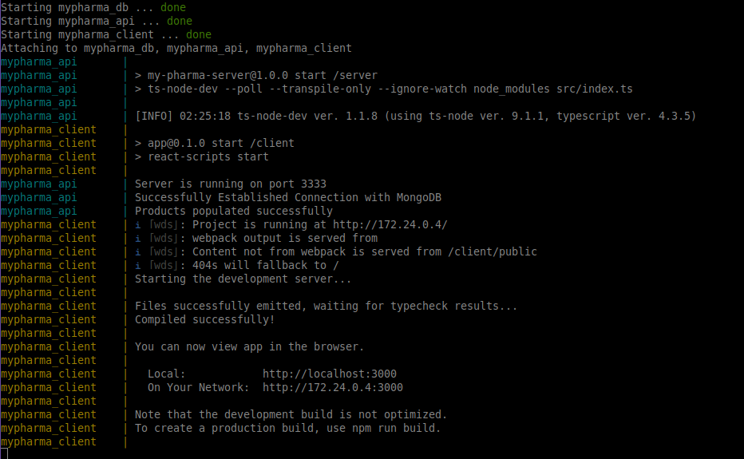

Assim que o projeto estiver rodando, será possível:

- Acessar o backend através de http://localhost:3333
- Acessar o frontend através de http://localhost:3000

# Backend

## Rotas Backend

## Criar produto

Endpoint: http://localhost:3333/api/product/

Método: POST

Descrição: Criar um novo produto.

Body:

```json
{
    "bar_code": "2313165468",
    "name": "Product Name",
    "description": "Descrição / Apresentação do produto",
    "price": 50.50,
    "quantity": 20,
    "image": File
}
```

Obs.: Essa requisição deve ser feita através de Multipart FormData, devido ao upload de imagem.

## Listar produtos

Endpoint: http://localhost:3333/api/product/filter/:filter

Método: GET

Descrição: Retornar listagem de produtos.

Params: filter = "available" ou "stock"

Obs.: Caso o campo "filter" do params seja igual a "available", será retornado todos os produtos que estão em estoque no momento. Caso seja "stock" então será retornado todos os produtos do sistema.

## Pegar informações do produto por ID

Endpoint: http://localhost:3333/api/product/getById/:productId

Método: GET

Descrição: Retornar um produto específico baseado no seu ID.

Params: productId

## Editar produto

Endpoint: http://localhost:3333/api/product/edit/:productId

Método: PATCH

Descrição: Editar um produto.

Body:

```json
{
    "bar_code": "2313165468",
    "name": "Product Name",
    "description": "Descrição / Apresentação do produto",
    "price": 50.50,
    "quantity": 20,
    "image": File
}
```

Obs.: Todos os campos são opcionais, caso queira editar apenas 1 campo, os outros não serão alterados. A requisição também é enviada pelo Multipart FormData caso seja necessário alterar a imagem.

## Comprar produto

Endpoint: http://localhost:3333/api/product/buy/:productId

Método: PATCH

Descrição: Comprar um produto, diminui a quantidade do produto em 1.

Params: productId

## Deletar produto

Endpoint: http://localhost:3333/api/product/:productId

Método: DELETE

Descrição: Deleta um produto do banco de dados.

Params: productId

# Frontend

## Telas Frontend

Foram desenvolvidas telas responsivas para Mobile, Tablet e Desktop. Sendo assim, os prints são correspondentes à essas telas.

## Mobile

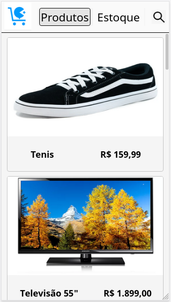
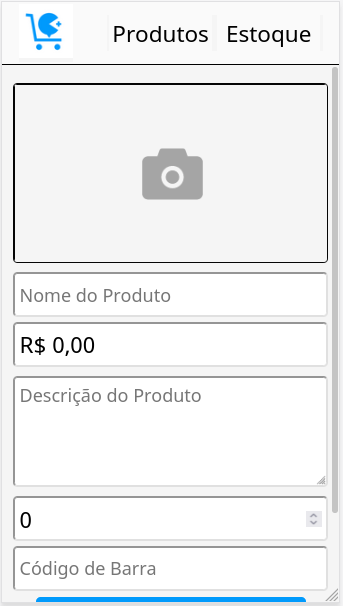
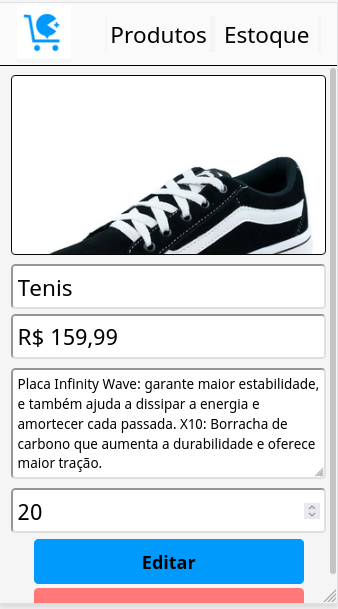
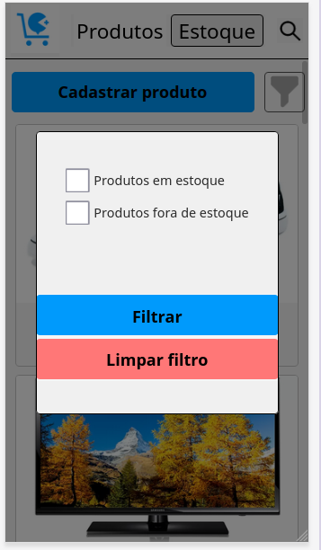
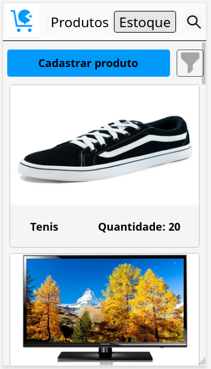
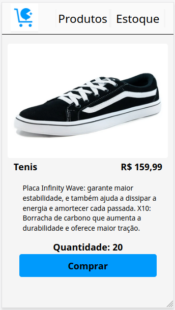

## Tablet

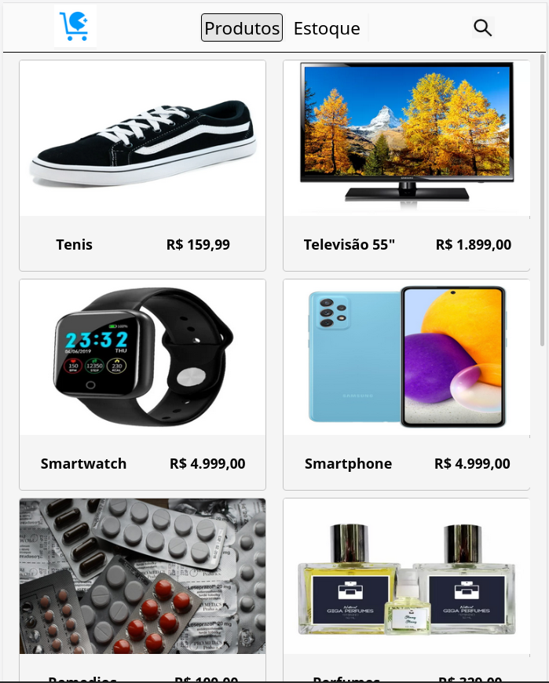
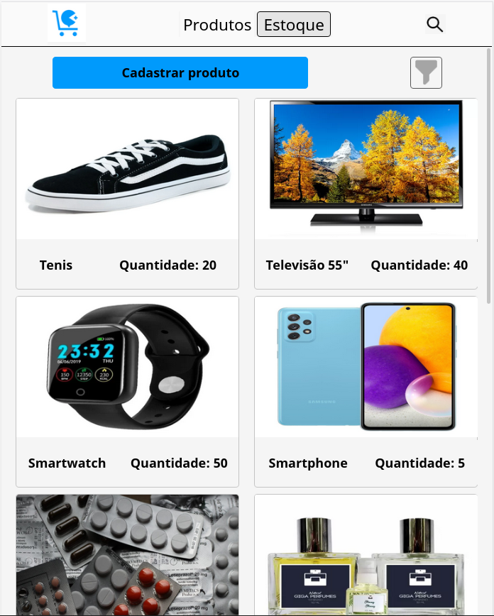
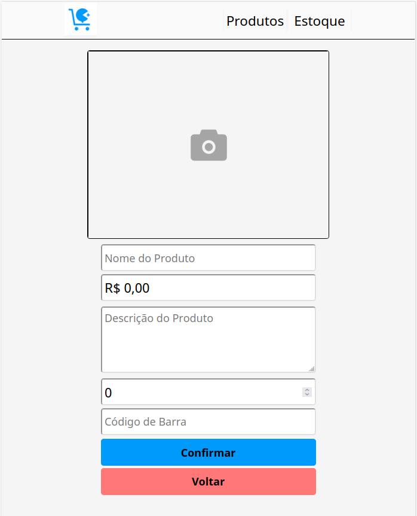
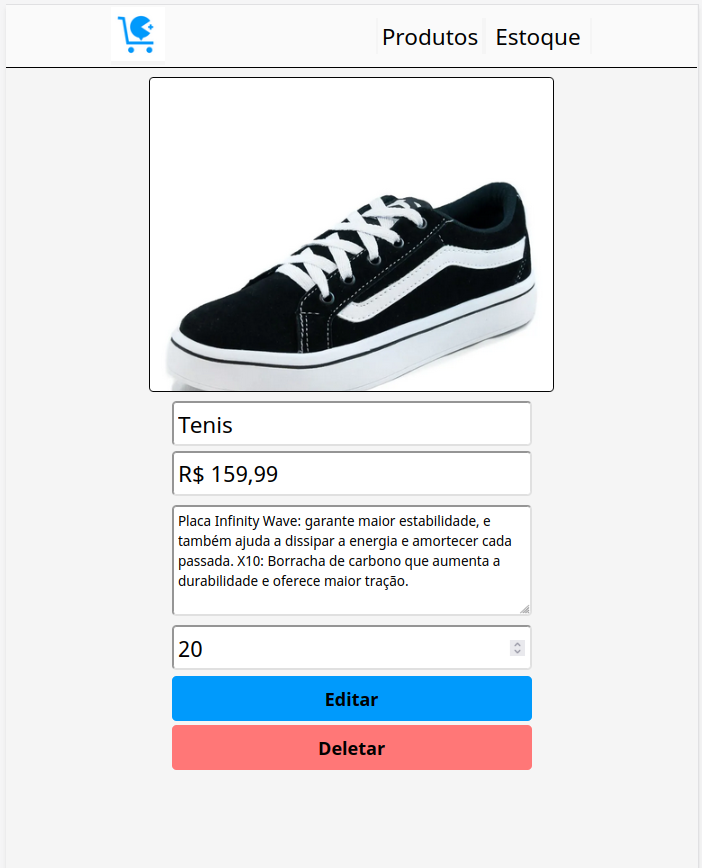
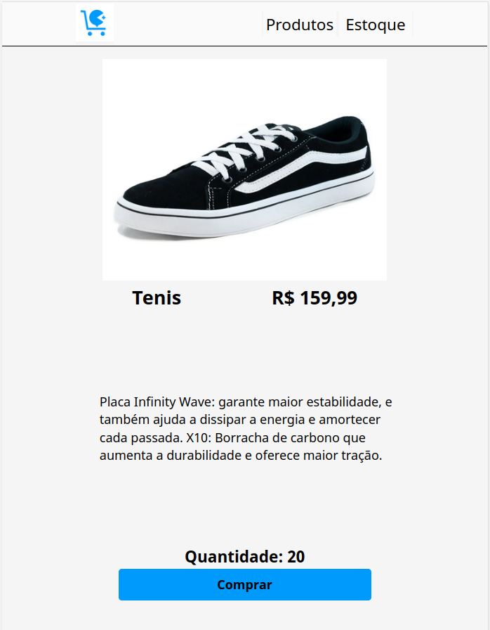

## Desktop

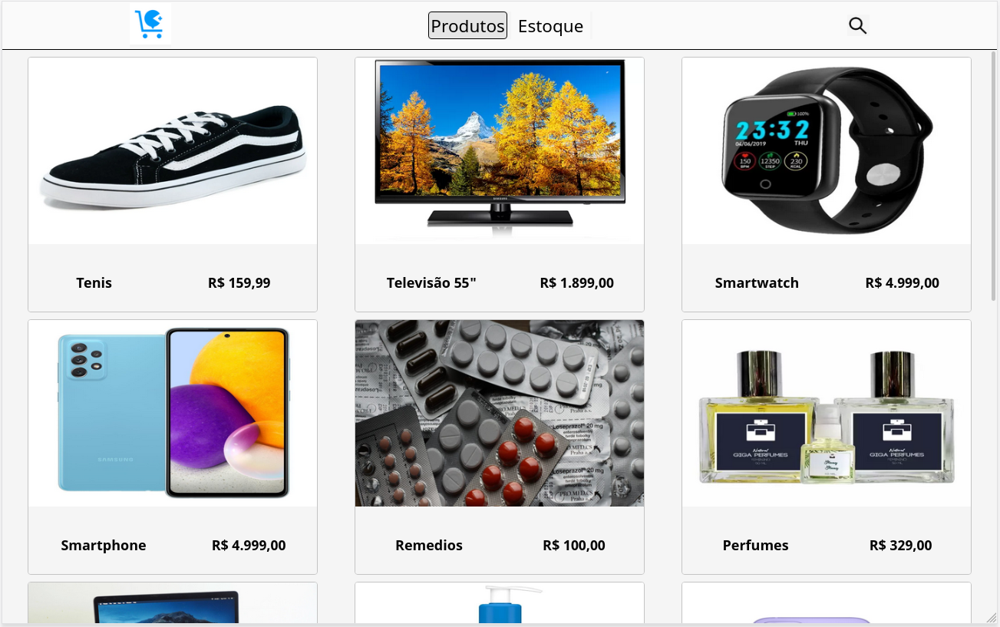
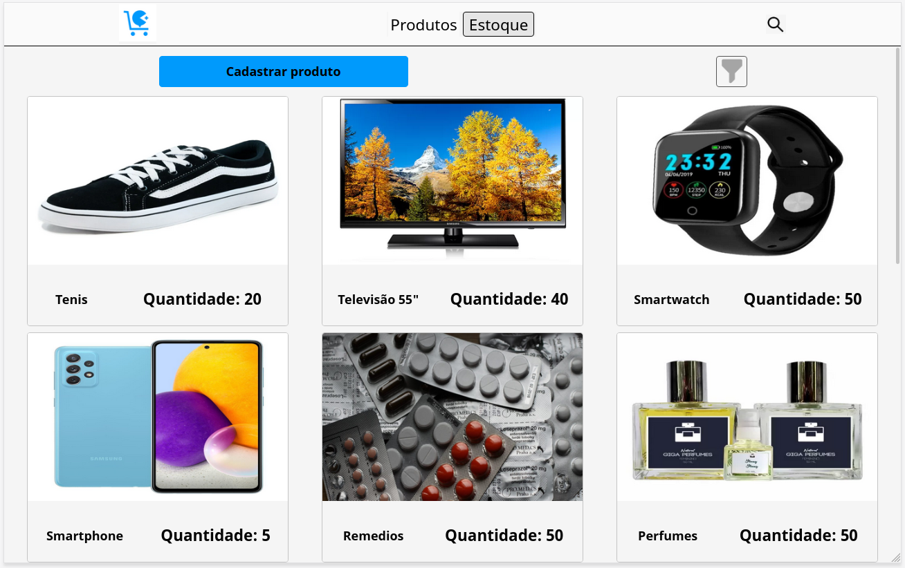
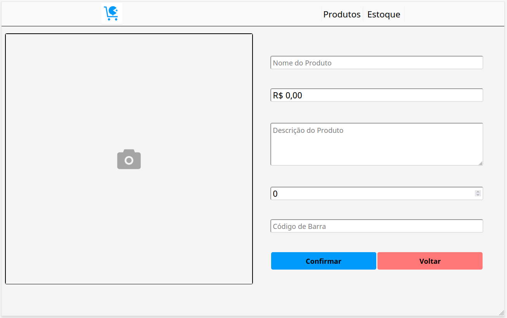
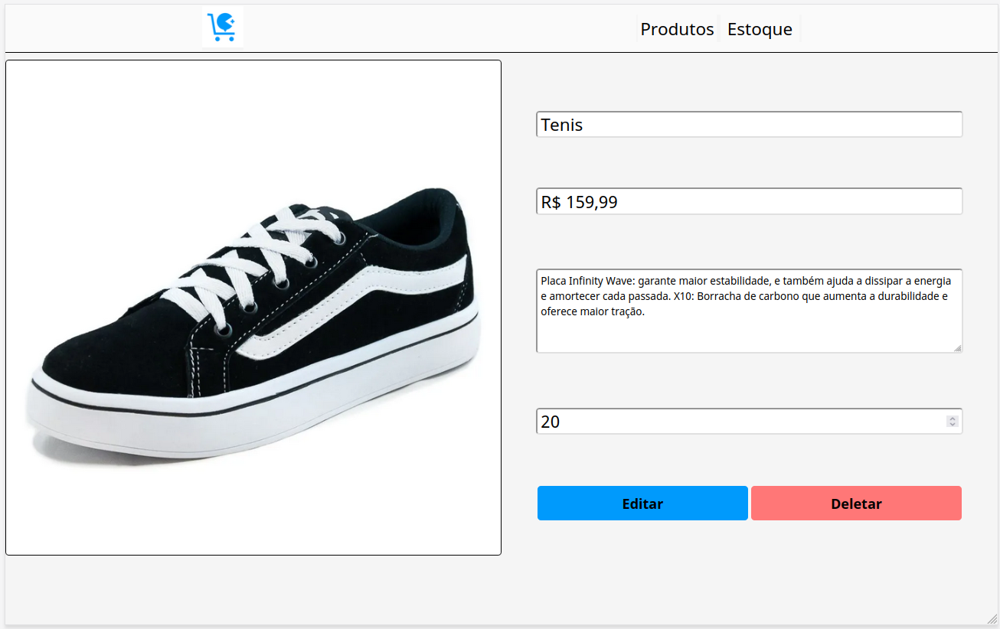
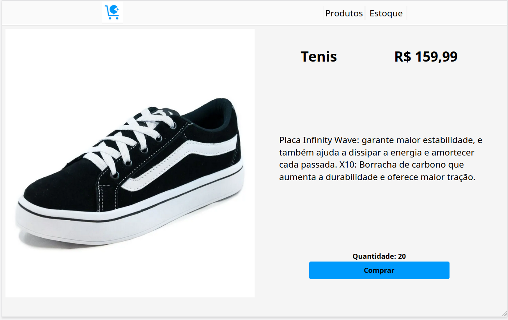
